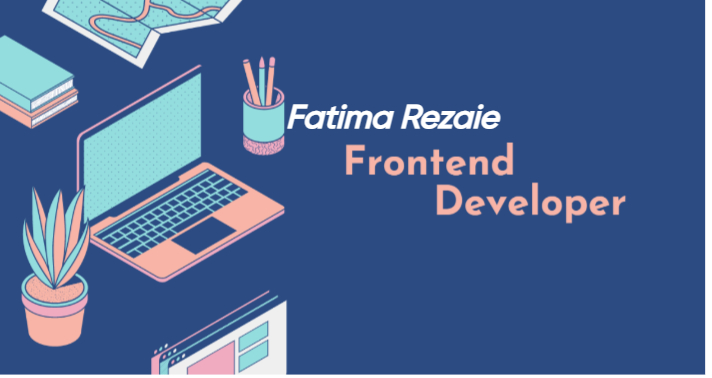

   <h2>👩‍💻 Seeking a New Opportunity</h2>
   

 I'm a highly motivated software developer with a passion for building impactful applications. And now I'm enrolled in 

  🎓 Student of Computer Science . 
  🏆 Certified Full-stack Developer. 
  💯 Dreamer , Believer & Explorer  
⚙️ My stack: HTML/CSS |Bootstap | JavaScript | React | Laravel | MYSQL| Php  

## 🌐 Socials:
  

# 💻 Tech Stack:
    

# 📊 GitHub Stats:
 
 

---

